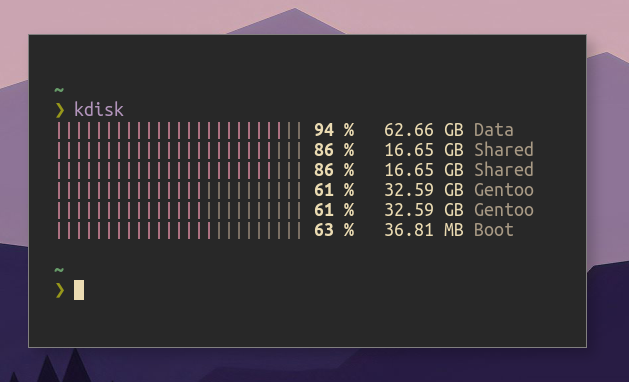

# kdisk
A tiny utility for displaying disk usage, written in Rust.

## Todo
- [x] Display filesystem labels
- [ ] Change bar color depending on usage percentage
- [ ] Sorting

## License
[MIT](./LICENSE)
